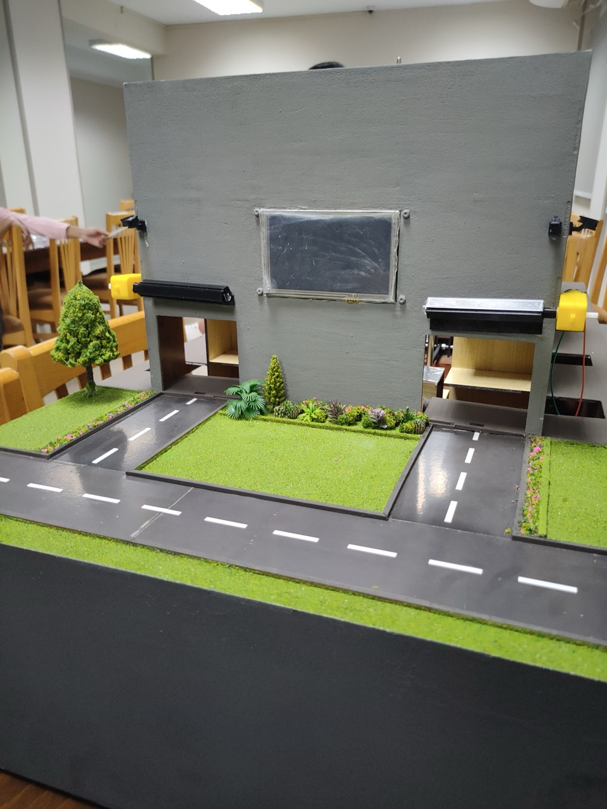

<!--  -->

## Project Title:
**Erkinly — Fully Automated Smart Parking Garage Prototype**

---

## Project Summary:
**Erkinly** (Arabic slang for "Park for me" – اركنلي) is a fully functional prototype of an Automated Parking System (APS) designed as my **Graduation Project**.  
The system minimizes parking space usage and automates the vehicle parking and retrieval process.

The system integrates hardware control, server communication, and a touch-screen driver interface, providing a seamless, efficient, and secure parking experience.  
"Erkinly" mirrors real-world APS operations by using motorized elevators and conveyors to transport vehicles automatically to assigned parking slots, managed through a user-friendly interface and mobile app integration.

---

## Technologies Used:
- **Microcontrollers:** Arduino Uno, ESP32
- **User Interface:** DWIN LCD Touch Display
- **Communication:** Wi-Fi (ESP32 <-> Server), Serial (ESP32 <-> Arduino)
- **Motors and Actuators:** DC Motors, Servo Motors, Motor Drivers (L298N)
- **Sensors:** Ultrasonic Sensors, Limit Switches
- **Programming Languages:** C/C++ (Arduino IDE), Embedded Systems Programming
- **Server Communication:** REST APIs (HTTP protocol)
- **Mobile App Integration:** QR Code Scanning (developed by mobile app team)

---

## My Role:
- **Project Manager:** Directed the project from concept to completion, handling planning, coordination, and testing.
- **Systems Architect:** Designed a scalable, modular system architecture connecting hardware, firmware, server, and mobile app.
- **Lead Embedded Developer:**  
  - Programmed Arduino for motor control and car movement automation.
  - Developed ESP32 firmware to handle server communication and system logic.
  - Designed and programmed the DWIN touchscreen user interface.
  - Developed the backend server.
- **Integration and Testing Lead:** Managed the full system integration and led troubleshooting, optimization, and user experience refinement.

*(Mobile application coding was handled separately by a mobile developer, under my technical guidance.)*

---

## How Erkinly Works:

### Parking Journey:
1. Driver arrives at the entrance and interacts with the DWIN touchscreen.
2. User selects "Park", and a unique QR code is generated on-screen.
3. The user scans the QR code using the Erkinly mobile app.
4. Mobile app communicates with the server to verify the parking request and process payment if necessary.
5. Server sends confirmation to the ESP32, which commands Arduino to open the entrance door.
6. After the car is placed inside, the system automatically transports it to a free parking slot using an elevator and horizontal motorized movements.

### Retrieval Journey:
1. Driver selects "Retrieve" on the touchscreen.
2. QR code appears; user scans via the Erkinly mobile app.
3. Server verifies and instructs the ESP32.
4. ESP32 commands Arduino to fetch the parked vehicle from its slot.
5. Vehicle is brought to the retrieval point, and the door opens for the driver to pick it up.

All payments and user verifications are managed securely through the mobile application.

---

## Key Achievements:
- Successfully designed and implemented a real-world Automated Parking System prototype.
- Led cross-component integration of embedded hardware, server communication, and mobile application workflows.
- Developed a touch-friendly driver interface using a DWIN LCD screen.
- Achieved robust and reliable motor synchronization for vertical and horizontal car movements.
- Created a secure, real-time communication channel between the parking system and cloud server.
- Delivered a working end-to-end system under the codename "Erkinly", with full user experience flow for both parking and retrieval.

---

## Demo Video:

[Watch the full Erkinly Demo Video: System carries the car to its parking slut](https://youtu.be/_xDPV_9PKwc)

---

## Source Code:
GitHub Organization: [https://github.com/Erkinly](https://github.com/Erkinly)

---

